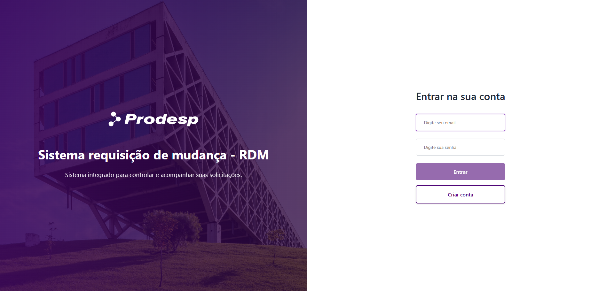

# 📊 Sistema RDM (Requisição de Mudança)

Sistema interno de **Requisição de Mudança (RDM)** desenvolvido para gerenciar solicitações, acompanhamento e fluxo de aprovação de mudanças em sistemas corporativos.

O projeto simula um cenário real de uso interno em empresas, com foco em **organização, rastreabilidade e controle das solicitações**, desde a criação até a aprovação final.



---

## 🧩 Funcionalidades

- Autenticação de usuários  
- Criação de requisições de mudança (RDM)  
- Acompanhamento do status das solicitações  
- Visualização de detalhes e histórico  
- Fluxo de aprovação por perfis administrativos  

> ⚠️ Algumas funcionalidades dependem da API backend, que ainda está em processo de deploy e integração.

---

## 🛠️ Tecnologias utilizadas

### Front-end
- Angular  
- TypeScript  
- HTML5  
- CSS3  

### Back-end
- API REST em .NET  
- PostgreSQL  

---

## 🤝 Colaboração

Este projeto foi desenvolvido em parceria:

- **Front-end**: Julia Benedicto  
  - Angular, organização de componentes, layout e fluxos de tela
  - LinkedIn: https://linkedin.com/in/julia-benedicto 

- **Back-end**: Luis Henrique Pinheiro  
  - API REST em .NET e banco de dados PostgreSQL  
  - GitHub: https://github.com/lhspinheiro  
  - LinkedIn: https://linkedin.com/in/lhspinheiro  

---

## 🚀 Como executar o projeto localmente

### Pré-requisitos

- Node.js  
- Angular CLI  

### Passos

```bash
# Clone o repositório
git clone https://github.com/juliabb/sistema_RDM.git

# Acesse a pasta do projeto
cd sistema_RDM

# Instale as dependências
npm install

# Execute a aplicação
ng serve
