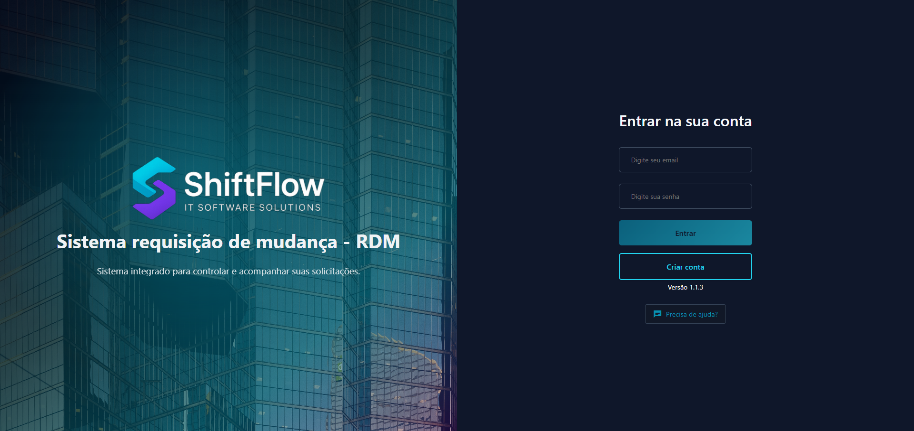

# 📊 Sistema RDM - ShiftFlow

Sistema de **Requisição de Mudança (RDM)** desenvolvido para gerenciar solicitações, acompanhamento, clonagem, relatórios e fluxo de aprovação de mudanças em sistemas corporativos.

O projeto simula um cenário real de uso interno em empresas, com foco em **organização, rastreabilidade, controle operacional e gestão de mudanças**, desde a criação da solicitação até a análise administrativa.



---

## 📌 Sobre o projeto

O **ShiftFlow RDM** é uma aplicação web criada para centralizar e organizar requisições de mudança em ambientes corporativos.

A aplicação permite que usuários registrem solicitações de mudança, acompanhem o andamento, consultem detalhes, clonem RDMs existentes e visualizem informações administrativas por meio de dashboards e relatórios.

> Este projeto foi adaptado para fins de portfólio, utilizando identidade visual e dados fictícios.

## Acesso demonstrativo

O projeto possui uma API simulada no próprio navegador e pode ser publicado como site estático, sem backend. Use:

- **E-mail:** `teste@teste.com`
- **Senha:** `Password@123`

A conta demonstrativa tem perfil de administrador. Os dados fictícios e as alterações feitas durante a navegação são mantidos no `localStorage` do navegador.

---

## 🧩 Funcionalidades

- Autenticação de usuários
- Controle de sessão com token JWT
- Criação de solicitações RDM em formulário dividido por etapas
- Validação de campos obrigatórios
- Upload de anexos em arquivo `.zip`
- Listagem de solicitações do usuário
- Visualização detalhada de RDMs
- Edição de solicitações com status específico
- Clonagem de RDM existente
- Filtros por sistema/serviço e período
- Dashboard administrativo
- Relatórios com cards e gráficos
- Exportação de relatório em PDF
- Exportação de relatório em Excel
- Tema claro e tema escuro
- Layout responsivo
- Controle de acesso por perfil administrativo

> O modo de demonstração intercepta as chamadas da aplicação e responde com dados fictícios locais.

---

## 🖼️ Principais telas

- Tela de login e cadastro
- Dashboard do usuário
- Formulário de nova solicitação RDM
- Modal de clonagem de RDM
- Listagem de solicitações
- Detalhes da solicitação
- Painel administrativo
- Relatórios administrativos com gráficos

---

## 🛠️ Tecnologias utilizadas

### Front-end

- Angular 20
- TypeScript
- HTML5
- CSS3
- Angular Material
- Angular CDK
- RxJS
- Chart.js
- ng2-charts
- jsPDF
- html2canvas
- Material Icons
- jwt-decode

### Back-end

- API REST em .NET
- PostgreSQL

---

## 📊 Relatórios e gráficos

A área administrativa possui relatórios com indicadores de solicitações, incluindo:

- Total de solicitações
- Solicitações por tipo:
  - Padrão
  - Normal
  - Emergencial
- Aprovações e reprovações
- Status de execução
- Solicitações por sistema/serviço
- Filtros por período
- Filtros por sistema ou serviço

Os gráficos são renderizados com **Chart.js** e os relatórios podem ser exportados em **PDF** e **Excel**.

---

## 🎨 Identidade visual

A interface utiliza uma identidade fictícia chamada **ShiftFlow**, com uma paleta baseada em tons de:

- Azul/ciano
- Roxo como cor secundária
- Cinzas neutros
- Suporte para tema claro e escuro

---

## 🤝 Colaboração

Este projeto foi desenvolvido em parceria:

### Front-end

**Julia Benedicto**

Responsável por:

- Desenvolvimento da interface em Angular
- Organização de componentes
- Layout responsivo
- Fluxos de tela
- Integração com API
- Dashboard, relatórios e formulários
- Adequação visual para portfólio

LinkedIn: [linkedin.com/in/julia-benedicto](https://linkedin.com/in/julia-benedicto)

### Back-end

**Luis Henrique Pinheiro**

Responsável por:

- API REST em .NET
- Estruturação do banco de dados PostgreSQL
- Endpoints de autenticação, RDMs e relatórios

GitHub: [github.com/lhspinheiro](https://github.com/lhspinheiro)  
LinkedIn: [linkedin.com/in/lhspinheiro](https://linkedin.com/in/lhspinheiro)

---

## 🚀 Como executar o projeto localmente

### Pré-requisitos

Antes de começar, é necessário ter instalado:

- Node.js
- npm
- Angular CLI

### Clonar o repositório

```bash
git clone https://github.com/juliabb/sistema_RDM.git
